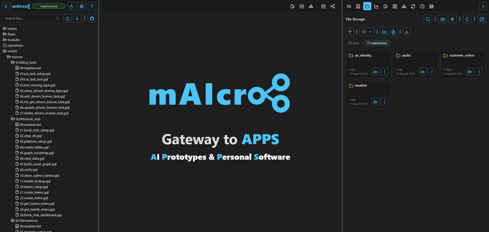
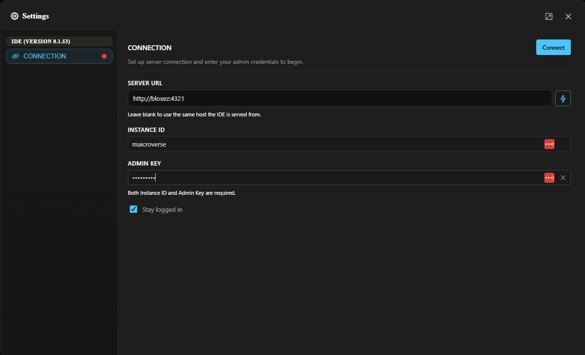

<div align="center">
  
  <p>AI Prototypes & Personal Software</p>
</div>

# Get started with mAIcroverse learning content

mAIcroverse provides your own personal learning experience. It is an isolated environment where you can safely learn and practice using mAIcro without risk of any damage to your ongoing prototype projects.

Anytime that you encounter a new feature of mAIcro that you haven't used before, when you might not feel 100% confident, simply drop into to the mAIcroverse instance, see if the feature is in one of the courses. If it is, you can see the feature in context.

The beauty of the courses is that they setup a clean environment. So let's imagine you run the Book Club course, which creates authors and books, and you edit the details of these items. You can simply run the Book Club setup again, and be back to a clean, documented, start position.

## Check that you're ready
You will need the mAIcro container to be running in docker. 

You can check that you have docker, and the maicro container running, by typing:

```
docker ps
```

If you see an error, that will likely mean docker is not setup.

The output from this command will show you that the maicro container is running. If you do not see it then you simply need to run the maicro setup.

## Setup mAIcroverse
Execute this command to create a maicroverse instance complete with course content:

```
docker exec -it maicro bash -lc 'curl -fsSL https://raw.githubusercontent.com/bloxez/maicroverse/main/create-mv.sh | bash'
```

This command fully automates the following steps:

1. Prompt you for your OPEN ROUTER API KEY.
2. Create a `maicroverse` instance if it doesn't already exist.
3. Install training courses, which are groups of scripts and data files.
4. Setup mAIql, your friendly AI agent inside mAIcro, with the most suitable models available on Open Router.

Here's what your maicroverse IDE will look like once all of the course content is installed:



## Connect to your mAIcroverse!
When you installed the mAIcro docker container it automatically created an instance called `maicro`.

An instance is an isolated environment. Create the `maicroverse` instance means you have a unique environment to learn and practice. Nothing from this environment will impact your `maicro` instance, where you might already be building your first prototype.

To connect to `maicroverse` open the settings dialog, and click the `Disconnect` button, if you are already connected to the `maicro` instance, for example.

INSTANCE ID: `maicroverse`
ADMIN KEY: `maicrog2a` (The default password, you can change this any time)

Click the `Connect` button and you will be quickly connected to the `maicroverse` instance, and will see all of the scripts and data files in file storage.



To connect back to the `maicro` instance, which is usually thought of as the default instance, do the same process as above. Disconnect, and connect to INSTANCE ID `maicro` with the ADMIN KEY, which by default is `maicrog2a`.

Have fun learning!
