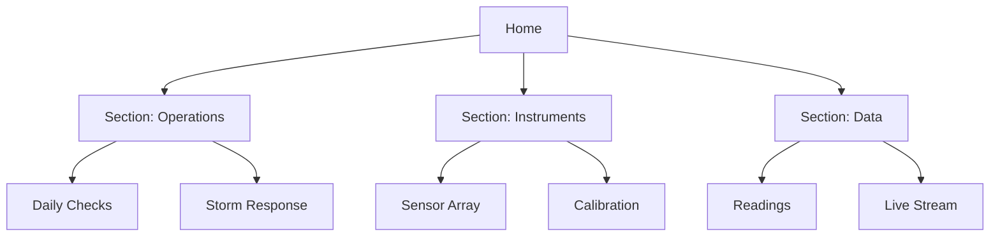

# Markdown Foundations

Markdown is the fastest way to turn a thought into a readable page. In mAIcro it
is a first-class project script: you write it in the editor, preview it live, link
pages together, and pull images and video straight out of File Storage.

This course walks through every capability the mAIcro preview supports, then puts
it all together in a small working wiki.

## How To Use This Course

1. Open a lesson file from the file tree under `scripts/courses/00500.markdown`.
2. Use the Markdown view switch to move between **Edit**, **Split**, and **Preview**.
3. Keep Split mode open while you read: the source is on the left, the result on the right.
4. Every lesson ends with a **Your Turn** task. Do it before moving on - it takes a minute
   and it is the part that actually sticks.

## Lesson Map

| File | What you learn | Why it matters |
| --- | --- | --- |
| `01.basics.md` | Paragraphs, breaks, emphasis, escaping, entities | Control the shape of a sentence |
| `02.structure.md` | Headings, quotes, callouts, rules | Give a page a skeleton |
| `03.lists-tables.md` | Bullets, numbers, tasks, tables | Make information scannable |
| `04.links.md` | Inline, reference, autolinks, page-to-page links | Turn pages into a network |
| `05.media.md` | External images and video, File Storage embeds | Show, do not describe |
| `06.code-html.md` | Fenced code, inline HTML, disclosure blocks | Document technical work |
| `07.mermaid.md` | Flowchart, sequence, state, class, ER, gantt, journey, pie, mindmap | Draw with text |
| `08.wiki/` | A complete Home to Section to Page wiki | See the whole thing working |

## The Wiki Demo

`08.wiki` is a small knowledge base for a fictional research site called
**Cloudbank Field Station**. It is organised the way real documentation should be:



Start at [Cloudbank Field Station wiki](./08.wiki/00.home.md) once you have finished the lessons.

> **Tip:** Right-click any `.md` file in the tree and choose **Browse**. That opens a
> read-only reader tab with back and forward buttons, and relative links move you from
> page to page inside the same tab - exactly like a browser. It is the best way to read
> the wiki.

In a normal editor tab, a relative link opens the target as a new editor tab instead, which
is what you want while you are writing rather than reading.

## Before You Start The Media Lesson

Lesson `05.media.md` and the wiki both embed files from File Storage under
`/maicroverse/wiki/`. If those images do not appear, import them once:

```graphql
mutation {
  FolderFetchFromUrl(
    url: "https://github.com/bloxez/maicroverse/tree/main/file_storage/wiki"
    path: "maicroverse/wiki"
    overwrite: true
  ) {
    path
  }
}
```

## Working Habit

Change something small, preview it, compare. Markdown rewards experiments because
nothing is ever more than one keystroke away from being readable again.
