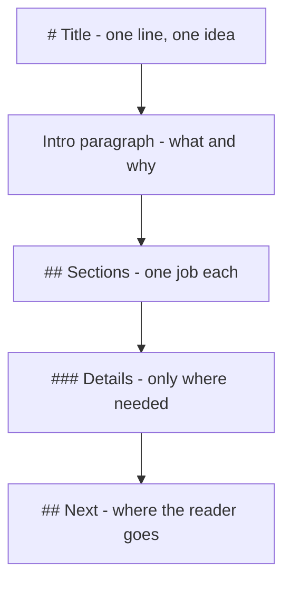

# 2. Page Structure

A page that is hard to scan is a page that does not get read. Headings, quotes and
rules are the skeleton that lets a reader jump straight to the part they need.

## Heading Levels

Markdown has six levels. Level 1 is the page title, and there should only ever be one.

## Level 2 - a major section

### Level 3 - a topic inside that section

#### Level 4 - a detail inside that topic

##### Level 5 - rarely needed

###### Level 6 - almost never needed

Two rules keep headings useful:

1. Never skip a level on the way down. `##` then `####` reads as a broken outline.
2. Write headings as labels, not sentences. "Storm Response" beats "What to do when
   a storm is coming".

> The mAIcro preview can number headings automatically. Turn it on when you are
> reviewing an outline, and off when you are reading for content.

## Blockquotes

> A blockquote holds words that are not yours: a policy, a spec, a message from
> someone else, or a warning worth slowing down for.
>
> > A nested quote shows a reply, or a quote inside a quote.

Blockquotes can contain any other block:

> ### Quoted heading
>
> - Quoted list item
> - Another item
>
> ```bash
> deno task dev
> ```

## Callout Patterns

Markdown has no built-in callouts, so documentation teams build them from a quote plus
a bolded label. Pick one set and use it everywhere.

> **Note:** the sensor mast is unpowered between 02:00 and 02:15 during nightly sync.

> **Tip:** run the calibration check before the daily upload, not after.

> **Warning:** never open the enclosure while the heater element is live.

## Horizontal Rules

A rule marks a real change of subject. Three or more dashes, asterisks or underscores
on their own line:

---

Use rules sparingly. If a page needs a rule every few paragraphs, it probably wants to
be two pages.

## A Page Shape That Works



## Your Turn

Add a `## Field Notes` section below with a quoted warning, a level-3 subheading, and
a horizontal rule before it. Preview and check the outline still reads top to bottom.
