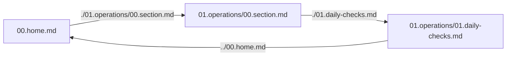

# 4. Links

A page with no outbound links is a dead end. This lesson covers every link form, and the
one that matters most inside mAIcro: a relative link to another project script.

## Inline Links

The basic form is `[visible text](destination)`.

- [The Mermaid documentation](https://mermaid.js.org/)
- [Markdown's original spec](https://daringfireball.net/projects/markdown/ "Daring Fireball")

The quoted string after the destination becomes a tooltip. Hover the second link to see it.

Write link text that makes sense when read alone. "See the calibration procedure" is
useful; "click here" is not.

## Autolinks

Wrap a bare URL or email address in angle brackets and it becomes a link:

- <https://github.com/bloxez/maicroverse>
- <fieldops@example.com>

GFM also linkifies plain URLs automatically: https://mermaid.js.org/

## Reference Links

When the same destination appears several times, or when a URL is long enough to wreck
the readability of a sentence, define it once at the bottom.

The station reports to the [regional hub][hub] every hour. If the [regional hub][hub] is
unreachable, readings queue locally until the next [sync window][sync].

You can also use the text itself as the label with [shortcut links][].

[hub]: https://example.com/hub "Regional data hub"
[sync]: https://example.com/sync
[shortcut links]: https://example.com/shortcut

Reference definitions are invisible in the preview, so keep them together at the end of
the file.

## Linking Within A Page

Every heading gets an anchor derived from its text: lowercased, spaces to dashes,
punctuation removed.

- Jump to [Reference Links](#reference-links)
- Jump to [Linking To Other Project Scripts](#linking-to-other-project-scripts)

This is how you build a table of contents at the top of a long page.

## Linking To Other Project Scripts

This is the important one. A relative link to another `.md` file in the project is live in
the preview.

- Same folder: [Media lesson](./05.media.md)
- Into a subfolder: [Wiki home](./08.wiki/00.home.md)
- Deeper still: [Daily Checks](./08.wiki/01.operations/01.daily-checks.md)
- Back up a level: from inside `08.wiki/01.operations`, `../00.home.md` returns to the home page

There are two ways to follow one:

| Mode | How to get there | What a link does |
| --- | --- | --- |
| Editor preview | Open the file, switch to Preview or Split | Opens the target in a new editor tab |
| Browse | Right-click the file in the tree, choose **Browse** | Navigates in place, with back and forward |

Relative links are what turn a folder of Markdown files into a navigable wiki. Section 8
of this course is built entirely from them.

## Linking To File Storage

A `storage:` link points at a file in File Storage. Clicking it opens or downloads the file.

- [Station overview photo](storage:/maicroverse/wiki/home/station-overview.jpg)
- [Data stream clip](storage:/maicroverse/wiki/data/data-stream.mp4)

The next lesson shows how to embed those files rather than just link to them.

## Images As Links

Wrap an image in a link to make the whole picture clickable:

## Your Turn

Add a short "See also" list at the bottom of this file with three links: one external,
one relative link to another lesson, and one reference-style link.
