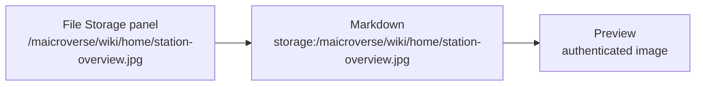

# 5. Images, Video And File Storage

Markdown has exactly one media syntax - `` - and mAIcro stretches it
in two useful directions: it plays video and audio, and it reads directly from File Storage.

## The Basic Syntax

```markdown

```

The alt text is not decoration. It is what a screen reader announces and what appears if
the file cannot load, so describe the picture rather than naming the file.

## External Images

Any public `https://` image works. These come from Pexels, which serves images without
authentication.


Many image hosts accept sizing parameters in the URL. Pexels uses `w=` - dropping it to
`w=400` gives you a thumbnail without any HTML:


## External Video

Point the same syntax at a video file and mAIcro renders a real player with controls.


Recognised video extensions are `.mp4`, `.webm`, `.ogv`, `.mov` and `.m4v`. Audio files -
`.mp3`, `.wav`, `.ogg`, `.m4a`, `.aac`, `.flac` - render as an audio player instead.

## File Storage: The `storage:` Prefix

Files you have uploaded to File Storage are addressed with `storage:` followed by the
storage path. No tokens, no long URLs, no copy-paste from the browser address bar.

```markdown

```


The path is exactly what you see in the File Storage panel. Right-click any file there,
copy its path, and put it after `storage:`.



Behind the scenes the preview swaps `storage:` for an authenticated file URL and adds
your session token. The token never gets written back into the file, so the Markdown
stays clean and shareable.

## Stored Video, With A Poster Frame

Video from File Storage works the same way. The optional title becomes the poster image -
the still frame shown before playback starts.


Without a poster, most browsers show a black rectangle until the first frame loads. With
one, the page looks finished even before anything is played.

## Sizing And Layout

Markdown cannot size an image. HTML can, and the preview renders it:


Two images side by side:

<p>
  
  
</p>

Centre a figure with a caption:

<p align="center">
  <br>
  <em>Figure 1 - overnight telemetry, rendered as light trails</em>
</p>

## Linking Instead Of Embedding

Sometimes you want the file, not the picture. Drop the leading `!`:

- [Download the station overview](storage:/maicroverse/wiki/home/station-overview.jpg)
- [Download the data stream clip](storage:/maicroverse/wiki/data/data-stream.mp4)

## Choosing A Source

| Source | Use it when | Trade-off |
| --- | --- | --- |
| External `https://` | The asset is public and someone else hosts it | Breaks if the host changes |
| `storage:` | The asset belongs to this project | Only visible to authenticated users |
| `data:` URI | The image is tiny, like an icon | Bloats the source file |

## Troubleshooting

> **Nothing appears at all.** Check the path in the File Storage panel. Storage paths are
> case-sensitive and start with `/`.

> **The image is missing but the alt text shows.** The file exists but is not an image
> type, or the extension does not match the stored content type.

> **Video shows controls but will not play.** The browser needs a format it supports -
> `.mp4` with H.264 is the safe choice.

## Your Turn

1. Upload any image of your own to File Storage.
2. Embed it here with a descriptive alt text and a sensible width.
3. Add a caption underneath it using the centred figure pattern.
