# 7. Mermaid Diagrams

A fenced block tagged `mermaid` renders as a diagram. The source stays in the file, so a
diagram can be reviewed in a pull request and fixed with a text editor.

## Flowchart

The workhorse. `TD` is top-down, `LR` is left-to-right.

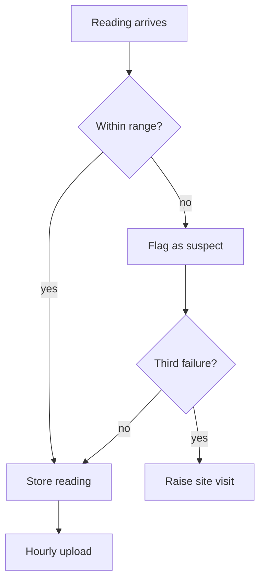

Node shapes carry meaning: `["box"]` for a step, `{"diamond"}` for a decision,
`(("circle"))` for a start or end, `[("cylinder")]` for storage.

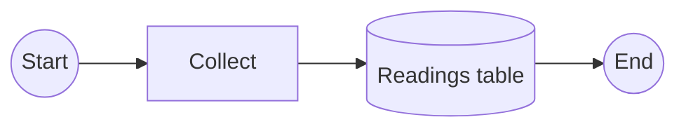

## Sequence Diagram

Best for showing who talks to whom, and in what order.

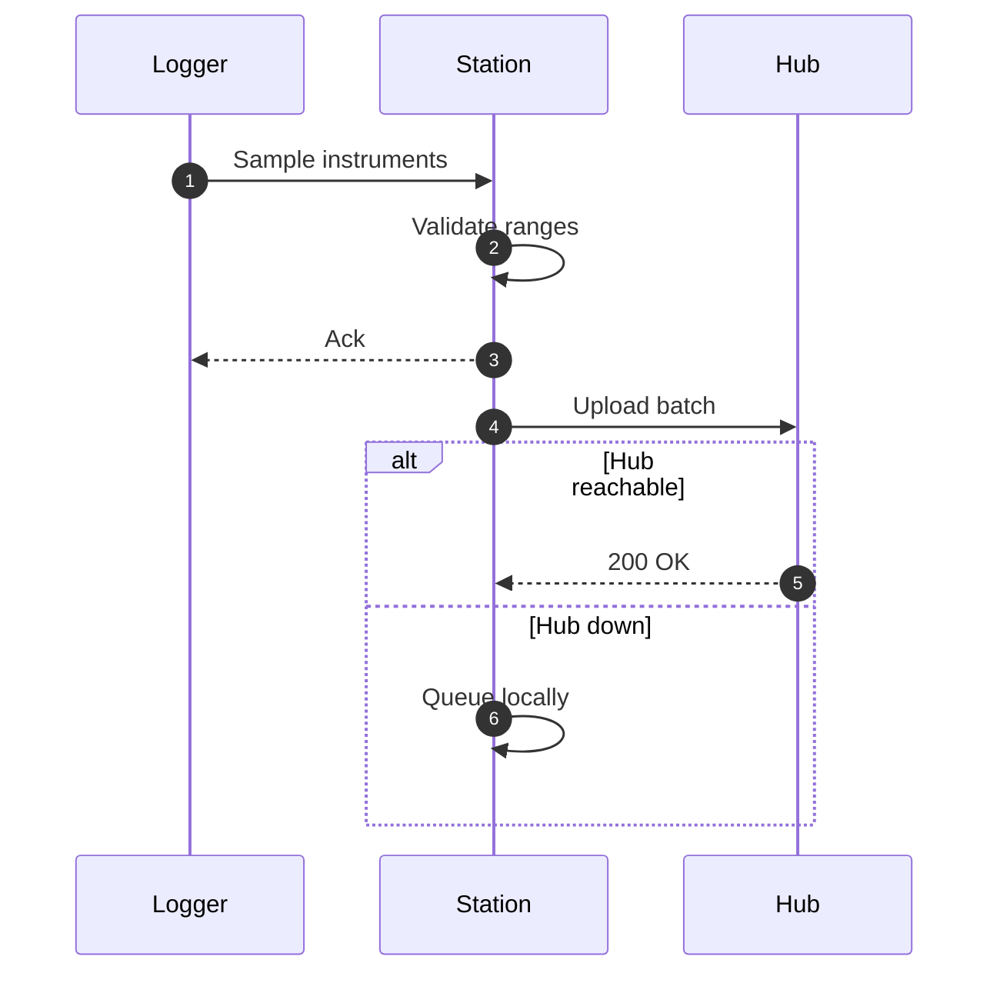

## State Diagram

Best for anything with a lifecycle.

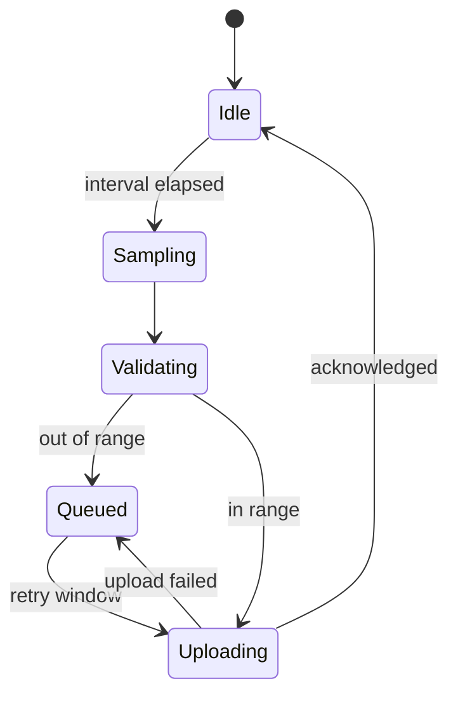

## Class Diagram

Best for the shape of a codebase or a data model with behaviour.

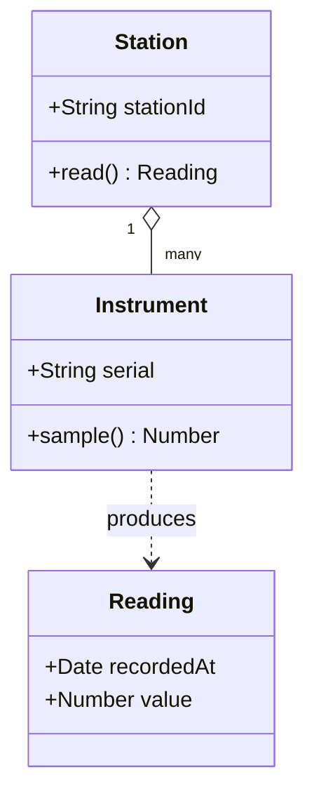

## Entity Relationship Diagram

Best for database design conversations.

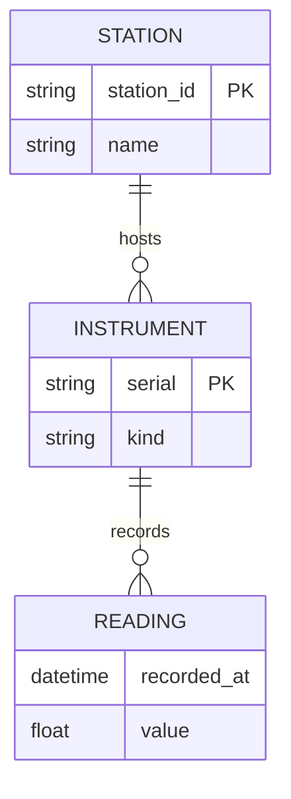

## Gantt Chart

Best for a plan that has to fit in a page.

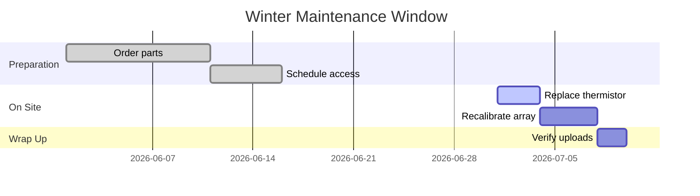

## User Journey

Best for describing an experience rather than a system.

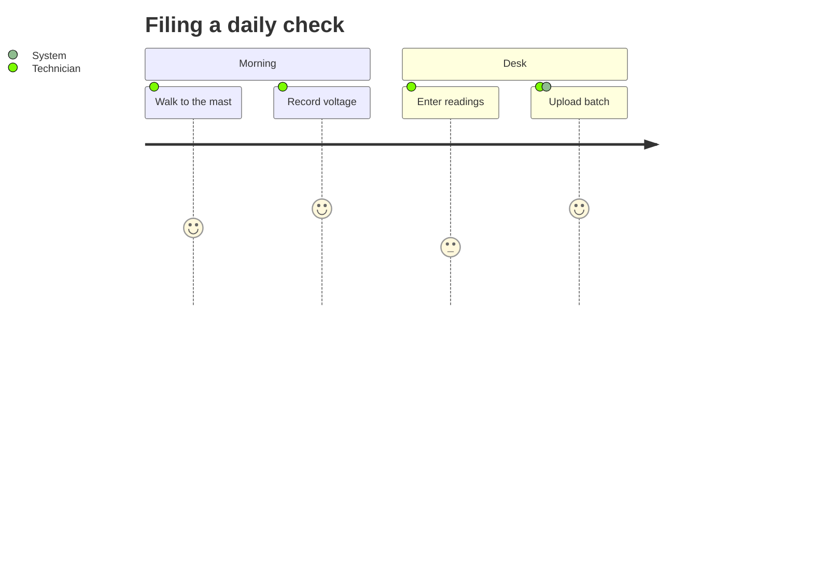

## Pie Chart

Best for one simple proportion, and nothing more complicated than that.

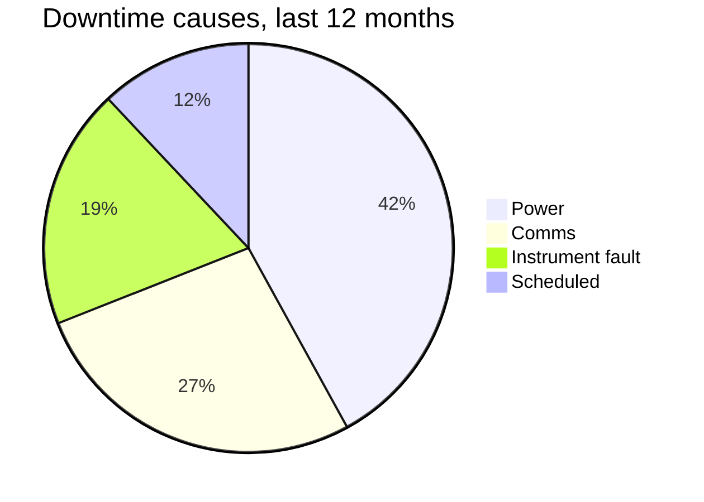

## XY Chart

Best for values measured across an ordered set of categories. It supports bar and line
series, including both in the same chart.

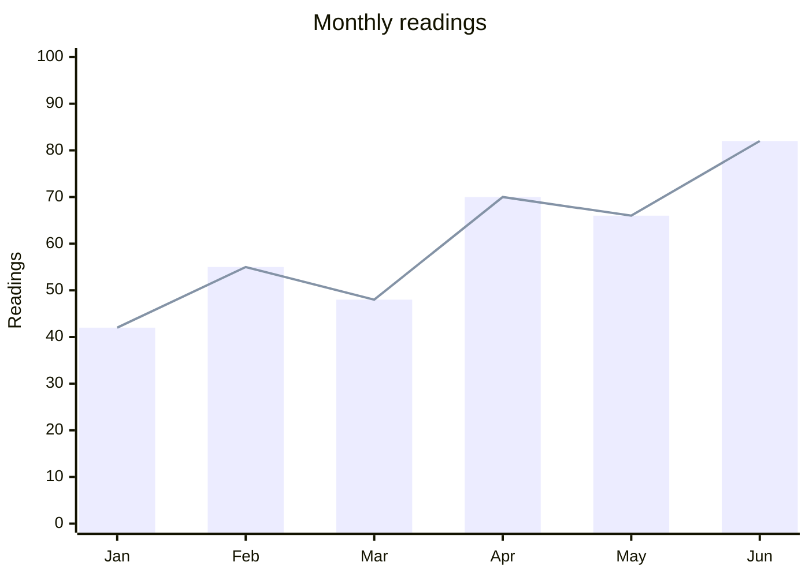

## Quadrant Chart

Best for comparing items against two criteria and deciding where to act.

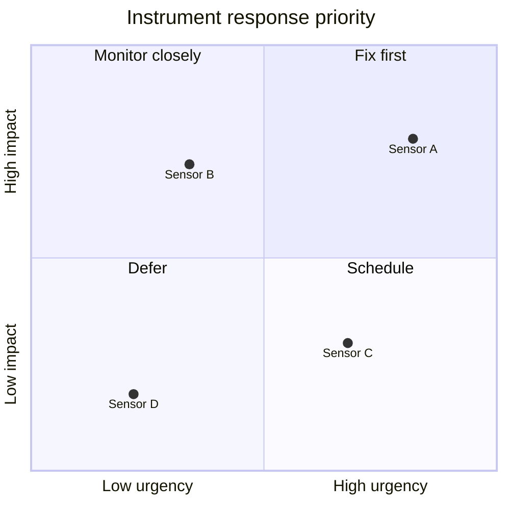

## Sankey Diagram

Best for showing quantities flowing between sources, stages, and destinations. Each
line is `source,target,value`.

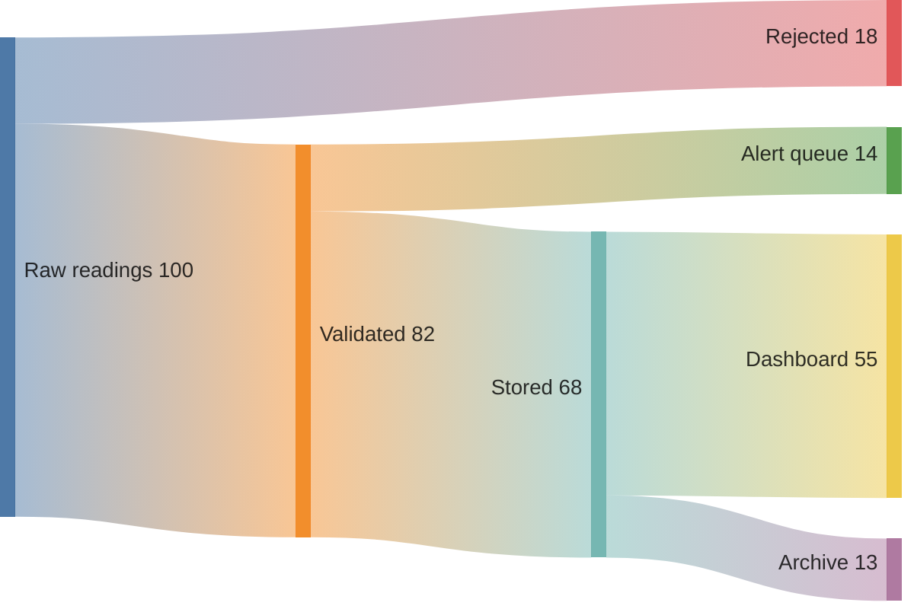

## Radar Chart

Best for comparing several items across the same dimensions.

## Treemap

Best for showing hierarchical proportions as nested rectangles.

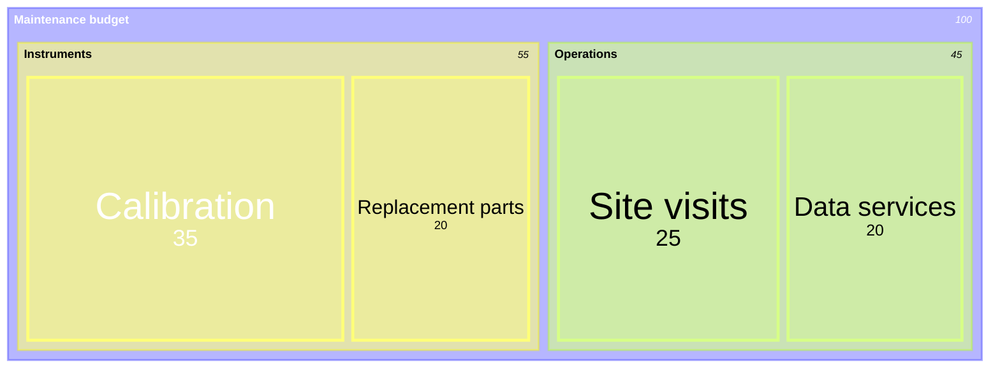

## Mindmap

Best for the early, messy stage of an idea.

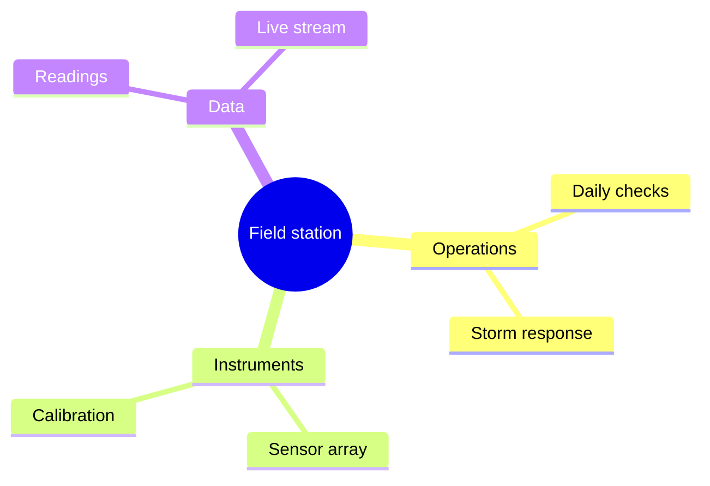

## Timeline

Best for history.

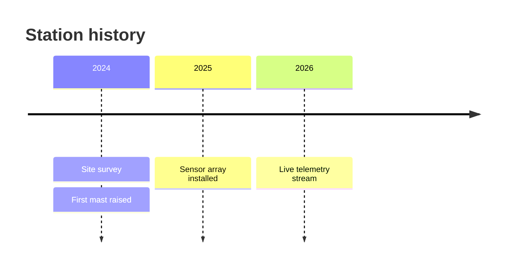

## Practical Advice

- One diagram, one idea. Two diagrams beat one crowded one.
- Label edges when the relationship is not obvious from the nodes.
- If a diagram needs a paragraph of explanation, the diagram is wrong.
- Keep node text short. Mermaid will not wrap it for you unless you use ` `.

## Your Turn

Take the flowchart at the top and add a branch for "instrument offline". Then redraw the
same logic as a state diagram and decide which one you would put in a runbook.
