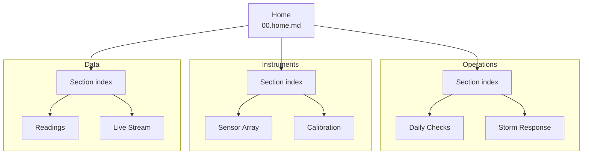

# Cloudbank Field Station


Welcome to the station handbook. Cloudbank is a remote environmental monitoring site:
one mast, three instrument groups, and an hourly upload to the regional hub. Everything
anyone needs to run the site lives on these pages.

This wiki is built entirely from Markdown project scripts. Each link below opens a real
file - there is no database, no CMS, and nothing to configure.

## Sections

| Section | What it covers | Start here |
| --- | --- | --- |
| **Operations** | Running the site day to day and when the weather turns | [Operations](./01.operations/00.section.md) |
| **Instruments** | What is installed, and how it is kept honest | [Instruments](./02.instruments/00.section.md) |
| **Data** | Where readings go and how to watch them move | [Data](./03.data/00.section.md) |

## How This Wiki Is Organised

Three levels, and no more. A home page points at sections, a section points at pages, and
a page does one job.



The folder layout mirrors the diagram exactly:

```
08.wiki/
├── 00.home.md
├── 01.operations/
│   ├── 00.section.md
│   ├── 01.daily-checks.md
│   └── 02.storm-response.md
├── 02.instruments/
│   ├── 00.section.md
│   ├── 01.sensor-array.md
│   └── 02.calibration.md
└── 03.data/
    ├── 00.section.md
    ├── 01.readings.md
    └── 02.live-stream.md
```

Because the folders match the structure, a relative link is always short:
`./01.operations/00.section.md` from home, `./01.daily-checks.md` inside a section, and
`../00.home.md` to come back.

## Station At A Glance

| Field | Value |
| --- | --- |
| Station ID | `CB-004` |
| Elevation | 1,240 m |
| Upload interval | Hourly, on the hour |
| Instrument groups | 3 |
| Established | 2024 |

## Common Tasks

- [ ] Run the [daily check](./01.operations/01.daily-checks.md)
- [ ] Confirm the [hourly upload](./03.data/01.readings.md) completed
- [ ] Review [calibration drift](./02.instruments/02.calibration.md) each Monday
- [ ] Re-read [storm response](./01.operations/02.storm-response.md) before every front

> **New here?** Read [Daily Checks](./01.operations/01.daily-checks.md) first. It is the
> only page you need before your first shift.
