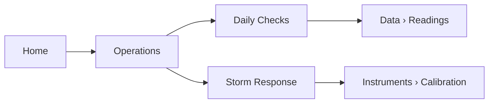

[Home](../00.home.md) › **Operations**

# Operations

Operations covers everything a person physically does at the station: the routine that
happens whether or not anything is wrong, and the routine that happens when something is.

## Pages In This Section

| Page | Read it when | Time |
| --- | --- | --- |
| [Daily Checks](./01.daily-checks.md) | Every shift | 10 min |
| [Storm Response](./02.storm-response.md) | A front is forecast within 24 hours | 40 min |

## Section Rules

1. Log every visit, even the uneventful ones. An empty log entry is data.
2. Never work on the mast alone.
3. If a reading looks wrong, record it anyway and flag it. Do not correct it in the field.

## Where This Fits

## Related

- [Instruments](../02.instruments/00.section.md) - what you are actually checking
- [Data](../03.data/00.section.md) - where the readings end up
- [Back to Home](../00.home.md)
