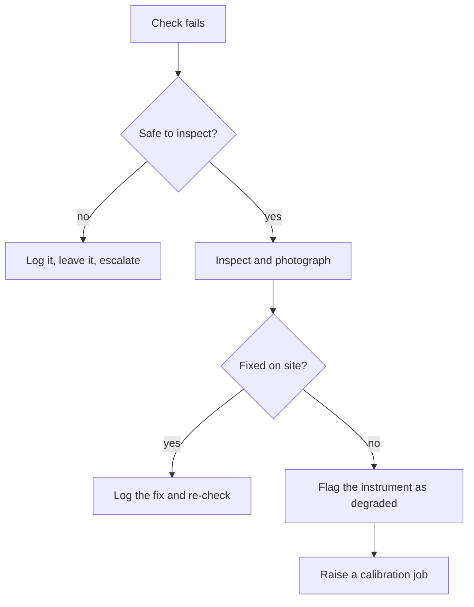

[Home](../00.home.md) › [Operations](./00.section.md) › **Daily Checks**

# Daily Checks

Ten minutes, once per shift. The point is not to find faults - most days you will not -
it is to build a continuous record so that the day something breaks, you know when.

## Checklist

- [ ] Battery voltage recorded
- [ ] Solar input recorded
- [ ] Rain gauge funnel clear
- [ ] Anemometer spins freely
- [ ] Enclosure sealed and dry
- [ ] Heartbeat visible in the console
- [ ] Previous hourly upload confirmed

## Thresholds

| Check | Normal | Action needed |
| :--- | :---: | :--- |
| Battery voltage | 12.4 - 13.8 V | Below 11.8 V - site visit within 24 h |
| Solar input | > 0.5 A in daylight | Zero in daylight - clean or inspect panel |
| Enclosure humidity | < 70% | Above 90% - suspect a seal failure |
| Heartbeat age | < 90 s | Above 300 s - see [Readings](../03.data/01.readings.md) |

## Recording A Check

Readings go in as a single row. The `flags` column is free text and is read by a person,
not a script - write what you saw.

```json
{
  "station_id": "CB-004",
  "recorded_at": "2026-08-19T06:12:00Z",
  "battery_v": 12.9,
  "solar_a": 1.4,
  "enclosure_rh": 58,
  "flags": "ok"
}
```

## If Something Is Wrong



<details>
<summary>Photograph guidelines</summary>

Photograph the fault before touching anything, then again after. Upload both to
File Storage under `/maicroverse/wiki/operations/` and link them from the log entry.

</details>

## Next

- Front forecast? Go to [Storm Response](./02.storm-response.md)
- Instrument suspect? Go to [Calibration](../02.instruments/02.calibration.md)
- [Back to Operations](./00.section.md)
