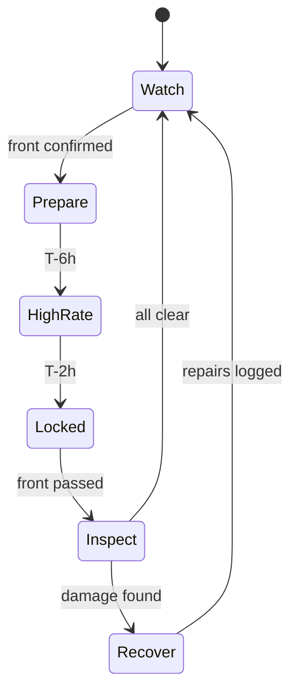

[Home](../00.home.md) › [Operations](./00.section.md) › **Storm Response**

# Storm Response


A front does two things to this site: it produces the readings we actually care about,
and it threatens the equipment collecting them. This page is the order of operations for
getting both right.

> **Warning:** nobody climbs the mast once sustained wind exceeds 25 kn. There is no
> reading worth it.

## Timeline

| When | Action | Owner |
| :--- | :--- | :--- |
| T-24 h | Confirm forecast, check battery reserve | Technician |
| T-12 h | Secure loose hardware, photograph the site | Technician |
| T-6 h | Switch logging to 15-second interval | Technician |
| T-2 h | Final upload, verify local queue has space | System |
| During | No site access | - |
| T+2 h | Visual inspection from ground level | Technician |
| T+24 h | Full inspection and calibration check | Technician |

## Switching To High-Rate Logging

```graphql
mutation {
  StationConfigSet(
    stationId: "CB-004"
    key: "sample_interval_s"
    value: "15"
  ) {
    stationId
    key
    value
  }
}
```

Remember to put it back to `60` once the front has passed. High-rate logging fills the
local queue in about eighteen hours.

## Decision Path



## After The Front

- [ ] Ground-level inspection photographed
- [ ] Sample interval returned to 60 s
- [ ] Local queue drained to the hub
- [ ] Gust maxima reviewed against neighbouring stations
- [ ] Calibration check scheduled

## Related

- [Daily Checks](./01.daily-checks.md) - the routine this replaces for 24 hours
- [Calibration](../02.instruments/02.calibration.md) - what to run afterwards
- [Live Stream](../03.data/02.live-stream.md) - watching the front arrive
- [Back to Operations](./00.section.md)
