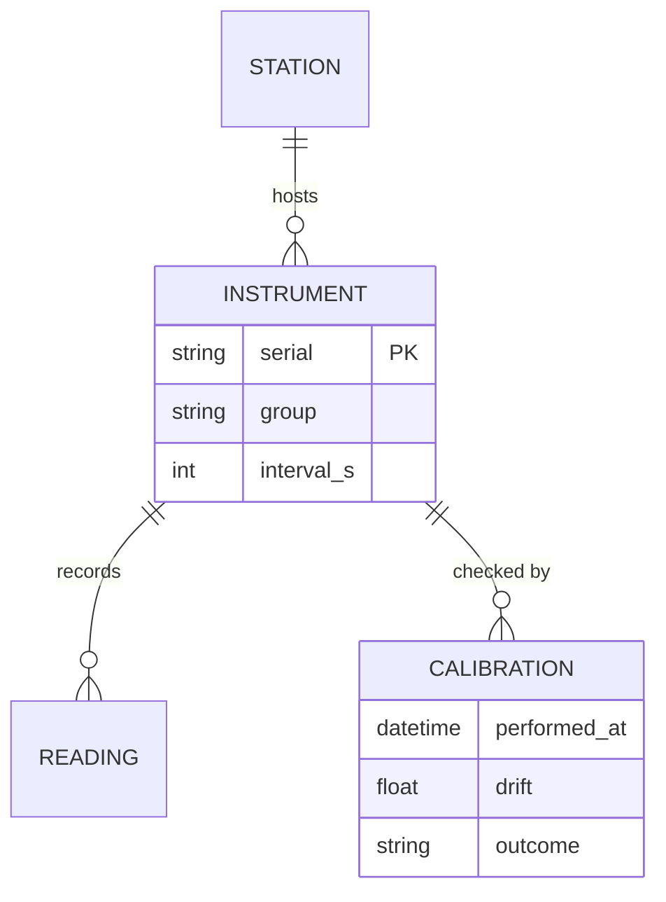

[Home](../00.home.md) › **Instruments**

# Instruments

Three instrument groups are installed at Cloudbank. This section describes what they are,
what they are supposed to read, and how we prove they still do.

## Pages In This Section

| Page | Covers |
| --- | --- |
| [Sensor Array](./01.sensor-array.md) | Layout, serials, and what each element measures |
| [Calibration](./02.calibration.md) | Drift limits, the weekly check, and the audit trail |

## Installed Hardware

| Group | Instrument | Serial | Interval |
| --- | --- | --- | :---: |
| Wind | Anemometer | `AN-2291` | 60 s |
| Wind | Vane | `VA-2292` | 60 s |
| Precipitation | Tipping rain gauge | `RG-0184` | 300 s |
| Atmosphere | Thermistor | `TH-7756` | 60 s |
| Atmosphere | Barometer | `BA-3310` | 300 s |
| Atmosphere | Hygrometer | `HY-3311` | 300 s |

## Data Model

## Related

- [Operations](../01.operations/00.section.md) - who checks these and when
- [Data](../03.data/00.section.md) - what the readings become
- [Back to Home](../00.home.md)
