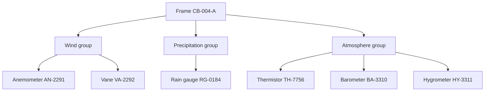

[Home](../00.home.md) › [Instruments](./00.section.md) › **Sensor Array**

# Sensor Array

   
  <em>The array during pre-installation assembly, 2025</em>

The array is a single frame carrying six elements. It replaced three separate masts, which
is why every element shares one power feed and one failure mode.

## Element Layout

## Ranges

| Element | Measures | Range | Resolution |
| :--- | :--- | :---: | ---: |
| Anemometer | Wind speed | 0 - 120 kn | 0.1 kn |
| Vane | Wind direction | 0 - 359° | 1° |
| Rain gauge | Rainfall | 0 - 300 mm/h | 0.2 mm |
| Thermistor | Air temperature | -40 - 60 °C | 0.1 °C |
| Barometer | Pressure | 800 - 1100 hPa | 0.1 hPa |
| Hygrometer | Relative humidity | 0 - 100% | 1% |

A reading outside these ranges is not a weather event. It is a fault.

## Shared Power

Every element draws from the same 12 V bus. When the bus sags, elements drop out in a
predictable order, which makes the pattern a useful diagnostic:

1. Heated rain gauge (highest draw)
2. Hygrometer
3. Barometer
4. Thermistor
5. Anemometer and vane (lowest draw, last to fail)

> **Note:** if the anemometer is offline while the barometer is fine, it is not a power
> problem. Check the cable at the frame junction.

Serial number format

Two letters for the element type, a dash, then a four-digit sequence. The sequence is
allocated per element type, not per station, so `AN-2291` and `RG-0184` may well have been
installed on the same day.

## Next

- [Calibration](./02.calibration.md) - proving these ranges are still true
- [Daily Checks](../01.operations/01.daily-checks.md) - the shift routine
- [Back to Instruments](./00.section.md)
