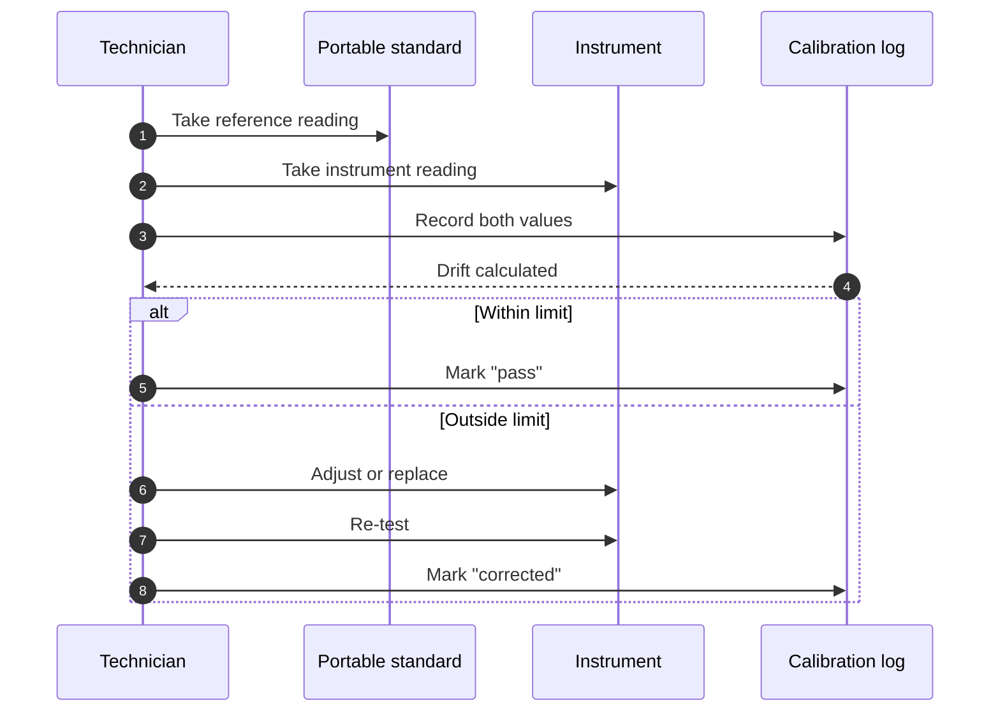
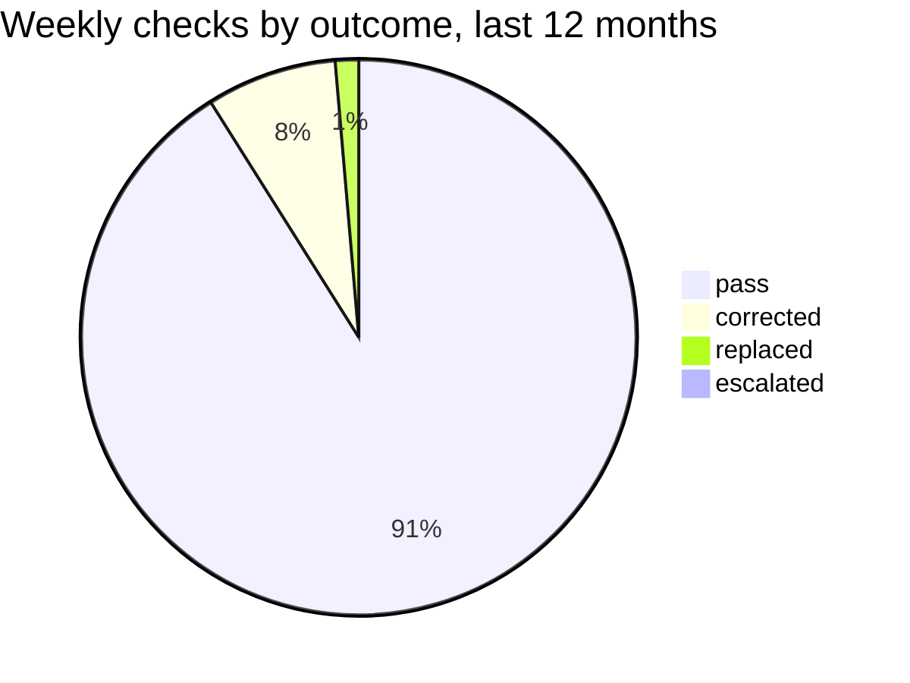

[Home](../00.home.md) › [Instruments](./00.section.md) › **Calibration**

# Calibration

Calibration is the difference between a dataset and a pile of numbers. This page defines
the drift limits, the weekly procedure, and what has to be written down.

## Drift Limits

| Element | Weekly limit | Quarterly limit | Action at limit |
| :--- | ---: | ---: | :--- |
| Anemometer | 0.3 kn | 0.8 kn | Field adjust |
| Vane | 2° | 5° | Field adjust |
| Rain gauge | 0.4 mm | 1.0 mm | Clean and re-test |
| Thermistor | 0.2 °C | 0.5 °C | Replace element |
| Barometer | 0.5 hPa | 1.2 hPa | Return to depot |
| Hygrometer | 3% | 6% | Replace element |

## Weekly Procedure

1. Run the reference sample against the portable standard.
2. Record both values, not just the difference.
3. Calculate drift as `measured - reference`.
4. If drift is within the weekly limit, log and stop.
5. If not, follow the action column and re-test before leaving the site.



## Log Entry

```json
{
  "serial": "TH-7756",
  "performed_at": "2026-08-18T09:40:00Z",
  "reference": 11.20,
  "measured": 11.34,
  "drift": 0.14,
  "outcome": "pass",
  "technician": "R. Okafor"
}
```

Outcomes are one of `pass`, `corrected`, `replaced` or `escalated`. Nothing else.

## Drift Over The Last Year



## After A Storm

A calibration check is mandatory within 24 hours of a front passing - see
[Storm Response](../01.operations/02.storm-response.md). Wind elements drift most, and
they drift silently.

## Related

- [Sensor Array](./01.sensor-array.md) - the ranges these limits protect
- [Readings](../03.data/01.readings.md) - how flagged readings are stored
- [Back to Instruments](./00.section.md)
