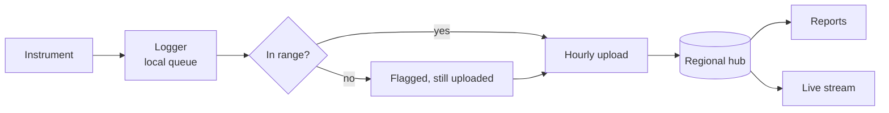

[Home](../00.home.md) › **Data**

# Data

Readings leave the station every hour and are never edited afterwards. This section
explains where they go, what the flags mean, and how to watch them arrive.

## Pages In This Section

| Page | Covers |
| --- | --- |
| [Readings](./01.readings.md) | Schema, flags, queries, and retention |
| [Live Stream](./02.live-stream.md) | Watching telemetry in near real time |

## The Path A Reading Takes

Nothing is discarded at the station. A suspect reading is flagged and sent anyway, because
the decision about what is real belongs downstream.

## Volumes

| Interval | Rows per day | Rows per year |
| :--- | ---: | ---: |
| 60 s elements (4) | 5,760 | 2,102,400 |
| 300 s elements (2) | 576 | 210,240 |
| Storm mode, 15 s | 23,040 | - |

## Related

- [Operations](../01.operations/00.section.md) - who produces these readings
- [Instruments](../02.instruments/00.section.md) - what produces them
- [Back to Home](../00.home.md)
