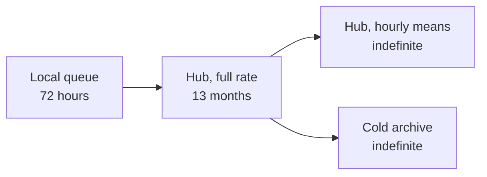

[Home](../00.home.md) › [Data](./00.section.md) › **Readings**

# Readings

One row per element per interval. No updates, no deletes - corrections are new rows that
reference the original.

## Schema

| Column | Type | Notes |
| :--- | :--- | :--- |
| `station_id` | text | Always `CB-004` here |
| `serial` | text | Element serial, e.g. `AN-2291` |
| `recorded_at` | timestamptz | UTC, set by the logger |
| `value` | numeric | Units implied by the element |
| `flags` | text | `ok` \| `stale` \| `range` \| `suspect` |
| `uploaded_at` | timestamptz | Set by the hub on receipt |

## Flags

> **`ok`** - the reading passed every range check.

> **`stale`** - the element did not report; the previous value was carried forward.

> **`range`** - the value fell outside the element's published range.

> **`suspect`** - the value is in range but inconsistent with neighbouring elements.

`stale` and `range` are set by the logger. `suspect` is set downstream, which is why a row
can arrive `ok` and become `suspect` later.

## Querying

The last ten wind readings:

```graphql
query RecentWind {
  weather_readings(
    where: { serial: { eq: "AN-2291" } }
    order: [{ key: "recorded_at", asc: false }]
    limit: 10
  ) {
    recorded_at
    value
    flags
  }
}
```

Everything flagged in the last day:

```graphql
query FlaggedToday {
  weather_readings(
    where: {
      flags: { neq: "ok" }
      recorded_at: { gte: "2026-08-18T00:00:00Z" }
    }
  ) {
    serial
    recorded_at
    value
    flags
  }
}
```

## Retention



Full-rate data older than thirteen months is available from the archive on request, but it
is not queryable directly.

<details>
<summary>Why corrections are new rows</summary>

Because someone always asks "what did we think at the time?". Keeping the original row
means the answer is a query rather than an argument.

</details>

## Related

- [Live Stream](./02.live-stream.md) - the same data, before it lands
- [Calibration](../02.instruments/02.calibration.md) - why a value might be suspect
- [Back to Data](./00.section.md)
