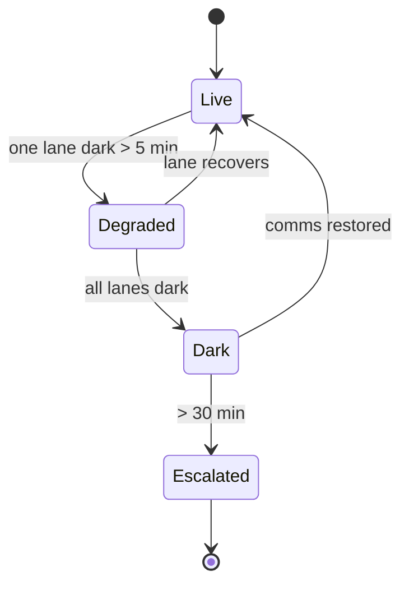

[Home](../00.home.md) › [Data](./00.section.md) › **Live Stream**

# Live Stream

Between hourly uploads the station also emits a low-bandwidth telemetry stream. It is not
authoritative - it is there so a person can see that the site is alive.

## Stream Visualisation

The clip below is the rendered visualiser, embedded straight from File Storage. The
optional title on the embed supplies the poster frame.


Each moving element is one instrument reporting. When a group stops, its lane goes dark
before any alert fires, which is usually the first sign anyone gets.

## Reading The Visualiser

| What you see | What it means |
| :--- | :--- |
| Steady flow | All elements reporting on interval |
| One dark lane | Single element offline |
| Lanes dimming in order | Power sag - see [Sensor Array](../02.instruments/01.sensor-array.md) |
| Everything dark | Comms loss, station probably fine |

## Comparison Footage

For contrast, this is public time-lapse footage of a remote camp at night, streamed
directly from an external host rather than File Storage:


Both embeds use the same Markdown syntax. The only difference is the source: `storage:`
for project files, `https://` for anything public.

## Stream Health



## Audio Alerts

The console can also play an alert tone on escalation. Audio files embed with the same
syntax and render as a player:

```markdown

```

## Related

- [Readings](./01.readings.md) - the authoritative record
- [Storm Response](../01.operations/02.storm-response.md) - what to watch during a front
- [Back to Data](./00.section.md)
