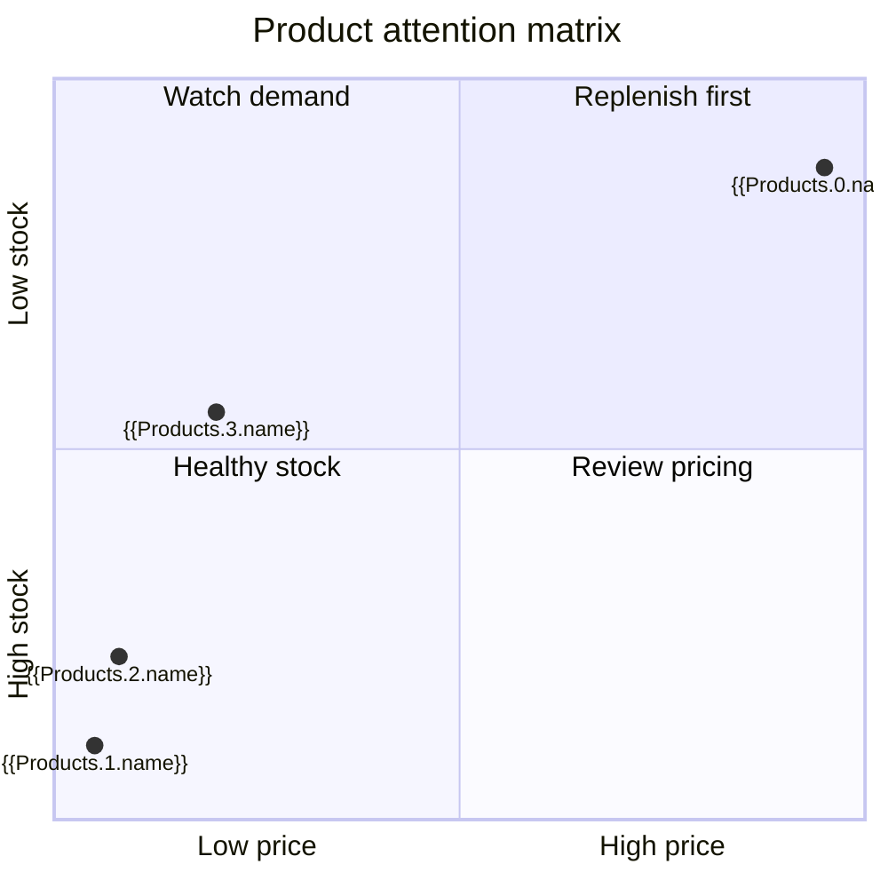

# Customer Orders Dashboard

> Prototype: a Markdown document whose data will eventually be produced by Maipad GraphQL blocks and rendered into tables and charts.

## Data Sources

```maipad
query Orders {
  FileDataset(path: "maicroverse/customer_orders/orders.jsonl")
}
```

```maipad
query Products {
  FileDataset(path: "maicroverse/customer_orders/products.csv")
}
```

```maipad
query OrderStatus {
  FileDatasetAggregate(
    path: "maicroverse/customer_orders/orders.jsonl"
    groupBy: "status"
  )
}
```

```maipad
query OrderRevenue {
  FileDatasetAggregate(
    path: "maicroverse/customer_orders/orders.jsonl"
    groupBy: "order_date"
    sumBy: "total_amount"
  )
}
```

```maipad
query InventoryByCategory {
  FileDatasetAggregate(
    path: "maicroverse/customer_orders/products.csv"
    groupBy: "category"
    sumBy: "stock_quantity"
  )
}
```

The document is rendered by executing the Maipad blocks and interpolating their named results. Aggregates are calculated by the backend before rendering.

## Order Snapshot

```table
data: Orders
columns: id,customer_id,order_date,status,total_amount
```

## Order Status

```chart
type: pie
title: Orders by status
data: OrderStatus
label: group
value: count
```

## Revenue By Date

```chart
type: bar
title: Order revenue by date
data: OrderRevenue
x: group
y: sum
axis: Order total ($)
```

## Inventory By Category

```chart
type: bar
title: Units in stock by product category
data: InventoryByCategory
x: group
y: sum
axis: Units in stock
```

## Product Price And Stock

This quadrant is a prototype for spotting products that combine high price with low stock.



## Future Rendering Contract

The backend rendering path now:

1. Run `Orders` and `Products` as the logged-in user.
2. Store each result in the Maipad context.
3. Computes grouped chart inputs with `FileDatasetAggregate`.
4. Interpolates the results into the Markdown and Mermaid blocks.
5. Returns a clear error when a query, aggregate, or chart transformation fails.
